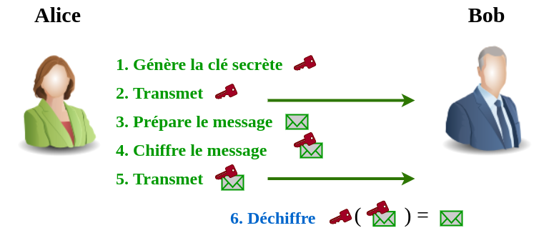
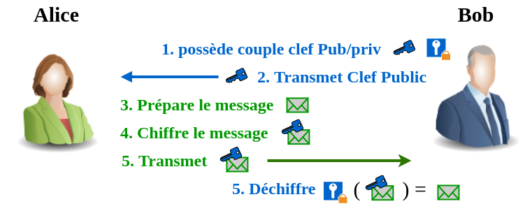
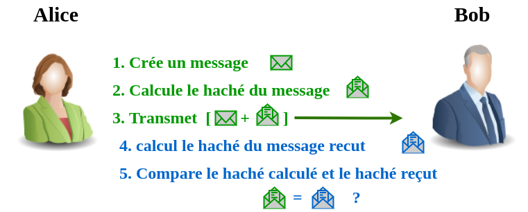
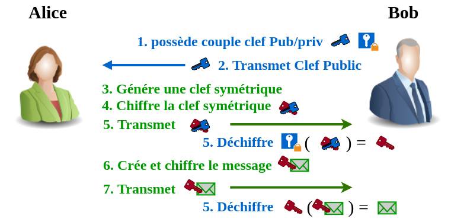
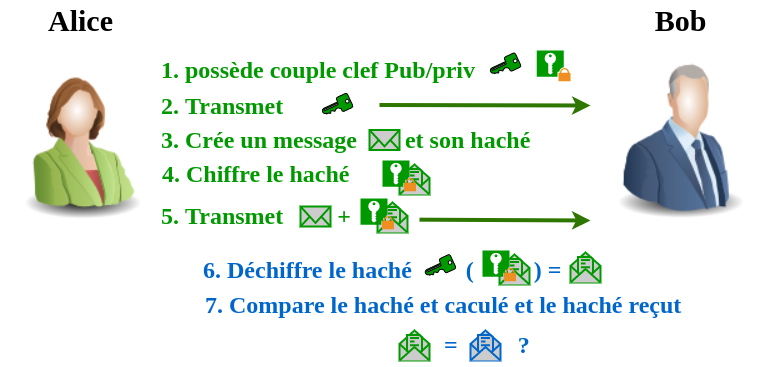
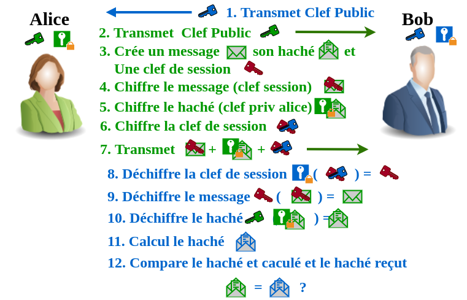
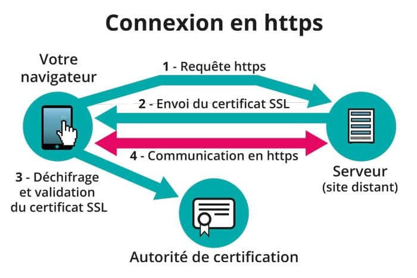
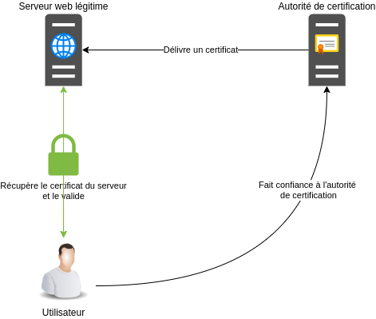

<style>

img[alt~="center"] {
  display: block;
  margin: 0 auto;
}

</style>

<!-- _class: titre -->


# Certificats

---
<!-- _class: EnAvant -->

Fichiers CSR, CRT, KEY, CA et PEM dans le contexte de la PKI
--------------------------------------------------------------------------

### Introduction

Ce cours vise à expliquer les concepts fondamentaux liés aux fichiers CSR, CRT, KEY, CA et PEM dans le contexte de l'infrastructure à clés publiques (PKI).

Prérequis:

-   Notions de base en cryptographie
-   Fonctionnement de la PKI

Objectifs:

-   Comprendre la différence entre les fichiers CSR, CRT, KEY et PEM
-   Savoir comment générer et utiliser ces fichiers
-   Appréhender le rôle de l'autorité de certification (CA)

### 1\. Fichiers CSR (Certificate Signing Request)

Un fichier CSR est une demande de signature de certificat. Il contient des informations sur l'entité qui souhaite obtenir un certificat numérique, telles que son nom, son adresse e-mail et sa clé publique. Le fichier CSR est généré par le demandeur du certificat et soumis à une autorité de certification (CA) pour validation et signature.

Contenu d'un fichier CSR:

-   Informations sur le demandeur (nom, adresse e-mail, etc.)
-   Clé publique du demandeur
-   Algorithme de signature utilisé
-   Hash de l'objet à signer

Formats de fichier CSR:

-   PEM (Privacy Enhanced Mail)
-   DER (Distinguished Encoding Rules)

### 2\. Fichiers CRT (Certificat)

Un fichier CRT est un certificat numérique émis par une CA. Il contient des informations sur le titulaire du certificat, telles que son nom, son adresse e-mail et sa clé publique, ainsi que la signature numérique de la CA. Le fichier CRT est utilisé pour authentifier l'identité du titulaire du certificat.

Contenu d'un fichier CRT:

-   Informations sur le titulaire du certificat (nom, adresse e-mail, etc.)
-   Clé publique du titulaire du certificat
-   Informations sur l'autorité de certification (nom, émetteur, etc.)
-   Signature numérique de la CA
-   Période de validité du certificat

Formats de fichier CRT:

-   PEM
-   DER

### 3\. Fichiers KEY (Clé privée)

Un fichier KEY est un fichier qui contient la clé privée du demandeur du certificat. La clé privée est utilisée pour décrypter les messages chiffrés et pour signer numériquement les documents. Il est important de garder la clé privée confidentielle et sécurisée.

Formats de fichier KEY:

-   PEM
-   DER
-   PKCS#8

### 4\. Autorité de certification (CA)

Une autorité de certification est une entité de confiance qui émet et gère les certificats numériques. La CA est responsable de la validation de l'identité des demandeurs de certificats et de la signature des certificats avec sa clé privée.

Rôles d'une CA:

-   Valider l'identité des demandeurs de certificats
-   Émettre et signer des certificats numériques
-   Révoquer les certificats compromis
-   Gérer la liste de révocation des certificats (CRL)

### 5\. Fichiers PEM (Privacy Enhanced Mail)

Le format PEM est un format de fichier standard pour stocker des données de sécurité numérique, telles que des certificats, des clés privées et des demandes de signature de certificat. Le format PEM utilise un encodage Base64 pour convertir les données binaires en une chaîne de caractères ASCII.

Avantages du format PEM:

-   Facilité de manipulation et d'échange
-   Compatibilité avec de nombreux logiciels et applications

---

# Certificats et Autorité PKI Privée avec OpenSSL

## Introduction

La gestion des certificats et la mise en place d'une autorité de certification (CA) PKI (Public Key Infrastructure) privée sont essentielles pour sécuriser les communications et authentifier les parties dans diverses architectures réseau. Ce cours vous fournira les bases nécessaires pour comprendre et travailler avec des certificats numériques, en utilisant OpenSSL comme outil principal.

## OpenSSL

OpenSSL est une puissante boîte à outils logicielle pour utiliser la cryptographie SSL/TLS. Elle permet de créer des clés privées, des certificats, de générer des demandes de signature de certificat (CSR) et de mettre en place votre propre autorité de certification (CA).

### Installation

```bash
# Sur les systèmes basés sur Debian/Ubuntu
sudo apt-get install openssl

# Sur les systèmes basés sur Red Hat/CentOS
sudo yum install openssl
```

## Formats de Certificats

Les certificats peuvent être présentés dans différents formats, les plus courants étant PEM, DER, et PKCS.

### PEM

- Le format le plus courant pour les certificats SSL/TLS.
- Encodé en Base64.
- Commence par `-----BEGIN CERTIFICATE-----` et se termine par `-----END CERTIFICATE-----`.

### DER

- Format binaire, non lisible directement.
- Utilisé principalement dans les environnements Java.

### PKCS

- Ensemble de standards pour la gestion des certificats.
- PKCS#12 (PFX) est souvent utilisé pour exporter et importer des certificats et des clés privées.

## Demande de Signature de Certificat (CSR)

Un CSR est une demande envoyée à une autorité de certification pour obtenir un certificat numériquement signé pour votre entité.

### Création d'un CSR

```bash
openssl req -new -key votreCléPrivée.key -out votreCSR.csr
```

## Liste de Révocation des Certificats (CRL)

Une CRL est une liste publiée par une autorité de certification qui contient les certificats révoqués avant leur expiration.

### Génération d'une CRL

```bash
openssl ca -gencrl -out crl.pem
```

## Online Certificate Status Protocol (OCSP)

OCSP est utilisé pour obtenir le statut de révocation d'un certificat spécifique sans nécessiter le téléchargement complet d'une CRL.

### Vérification avec OCSP

```bash
openssl ocsp -issuer issuer_cert.pem -cert cert.pem -url http://ocsp.mydomain.com
```


# Cryptographie

1.  Cryptographie Symétrique et Asymétrique :

    -   La cryptographie symétrique utilise une seule clé pour chiffrer et déchiffrer les données. Les algorithmes symétriques sont généralement plus rapides mais nécessitent une gestion sécurisée des clés.
    -   La cryptographie asymétrique utilise une paire de clés : une clé publique et une clé privée. La clé publique est utilisée pour chiffrer les données tandis que la clé privée correspondante est utilisée pour déchiffrer les données. Cette approche offre des avantages en termes de sécurité, notamment en ce qui concerne la distribution des clés.
2.  Fonctions de Hachage :

    -   Les fonctions de hachage sont des algorithmes qui prennent des données en entrée et produisent une empreinte numérique de longueur fixe en sortie. Cette empreinte est unique pour chaque ensemble de données d'entrée et permet de vérifier l'intégrité des données.
3.  Signature Numérique :

    -   Les signatures numériques sont utilisées pour vérifier l'authenticité et l'intégrité des données. Elles sont créées en utilisant une clé privée pour chiffrer une empreinte numérique des données, et peuvent être vérifiées à l'aide de la clé publique correspondante.
4.  Certificats Numériques :

    -   Les certificats numériques sont des documents électroniques qui associent une identité à une clé publique. Ils sont signés numériquement par une autorité de certification (CA) et servent à établir la confiance dans les échanges numériques.
5.  Protocoles de Sécurité :

    -   Comprendre les protocoles de sécurité, tels que SSL/TLS (Secure Sockets Layer/Transport Layer Security), qui utilisent des certificats PKI pour sécuriser les communications sur Internet.
6.  Gestion des Clés :

    -   La gestion sécurisée des clés est cruciale en cryptographie. Cela implique la génération sécurisée des clés, la distribution sécurisée des clés, la rotation régulière des clés, et la révocation des clés compromises.
7.  Attaques Cryptographiques :

    -   Connaître les différentes attaques cryptographiques, telles que les attaques par force brute, les attaques par canal auxiliaire, et les attaques par faute, afin de comprendre les vulnérabilités potentielles des systèmes cryptographiques.

---

### Les clefs de la confiance

* Authentification de l'éméteur
* Authentification du recepteur
* Confidentialité 
* intégrité 

---
## La confiance 

### Les clefs de la confiance

- Authentification de l'éméteur
- Authentification du recepteur
- Confidentialité 
- intégrité 

### A prendre en compte : 

* Vitesse de traitement 


---
<!-- _class: i1t2 -->

### Cryptographie Symétrique 




<!--  Confidentialité / vitesse traitement-->

---
<!-- _class: i1t2 -->

### Cryptographie Symétrique 


<!--  Confidentialité / vitesse traitement-->


--- 
<!-- _class: i1t2 -->

### Cryptographie Asymétrique




<!-- confidentialité / authentification du destinataire  -->

--- 
<!-- _class: i1t2 -->

### Cryptographie Asymétrique


<!-- confidentialité / authentification du destinataire  -->


--- 
<!-- _class: i1t2 -->

### Fonction de hachage




<!-- intégrité  -->

--- 
<!-- _class: i1t2 -->

### Fonction de hachage


<!-- intégrité  -->


--- 
<!-- _class: i1t2 -->

### Asymétrique + Symétrique




<!-- Confidentialité, Authen dest, vitesse Traitement -->

--- 
<!-- _class: i1t2 -->

### Asymétrique + Symétrique


<!-- Confidentialité, Authen dest, vitesse Traitement -->


---
<!-- _class: i1t2 -->

### Signature (Hachage + Asymétrique)




<!-- Authen Emeteur, intégrité -->

---
<!-- _class: i1t2 -->

### Signature (Hachage + Asymétrique)


<!-- Authen Emeteur, intégrité -->


---
<!-- _class: i1t2 -->


### Signature, authentification et Chiffrement




<!-- Authent emeteur, recepteur, confidentialité intégrité citesse traitement-->

---
<!-- _class: i1t2 -->


### Signature, authentification et Chiffrement


<!-- Authent emeteur, recepteur, confidentialité intégrité citesse traitement-->

---
<!-- _class: titre -->

## **PKI**
### **P**ublic **K**ey **I**nfrastructure 
### Infrastructure à clées publiques

---
# SSL / TLS 

## **T**ransport **L**ayer **S**ecurity

#### Remplace SSL (**S**ocket **S**ecure **L**ayer) : 

- **Authentification** du serveur
- **Confidentialité** des données échangées 
- **intégrité** des données échangées

## Actuelement TLS v 1.3

<!--
On confond souvant les deux dans le langage "courant" 

 SSL : inialement devellopé pour le navigateur netscape 
Compatibilité ascendante : En début de connexion, nego de la meilleurs version du protocole dispo

-->

---
# Certificat  

## Contenue d'un certificat (SSL/TLS) : 
- Nom de domaine
- Autorité de certification
- Date d'émission
- Date d'expiration
- Clé publique
- Version SSL/TLS
- Signature numérique de l'autorité de certification


<!-- 
Rappel : Signature = chiffrement du hache avec une clef privée.


-->
---
<!-- _class: EnAvant -->
# Certificat autosigné 

* ### **Signature du certificat avec la clef privée de l'émeteur** 
* #### Certificat + Clé privée = Identité numérique

<!-- 

-->
---
# Certificat autosigné 
## **Inconvénient** : 
* Implique de posséder la clef public
* Nécéssite de faire confiance à l'émeteur
* Perte de la clée privée => compromission.

---
# Certificat autosigné 
## **Inconvénient** : 
- Implique de posséder la clef public
- Nécéssite de faire confiance à l'émeteur
- Perte de la clée privée => compromission.
<BR><BR>
## ➢ Difficilement gérable à grande échelle
  


---
# CA : **C**ertification **A**uthority

Initiation d'une connexion sécurisée par SSL Autorité de certification (CA - Certificate authority) 





### Authorité de certification 
- Tiers de confiance 
- gére les certificats
- peut gérer les identités numérique
- Signe les certificats 
- signe la CRL (**C**ertificate **R**evocation **L**ist)

<!-- id num = certif plus clef privée -->
## Confiance dans la CA

---

